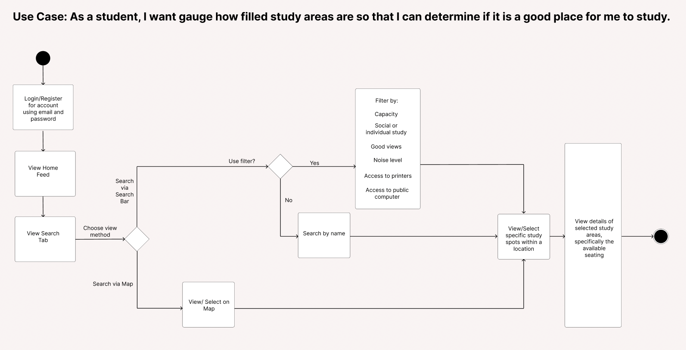
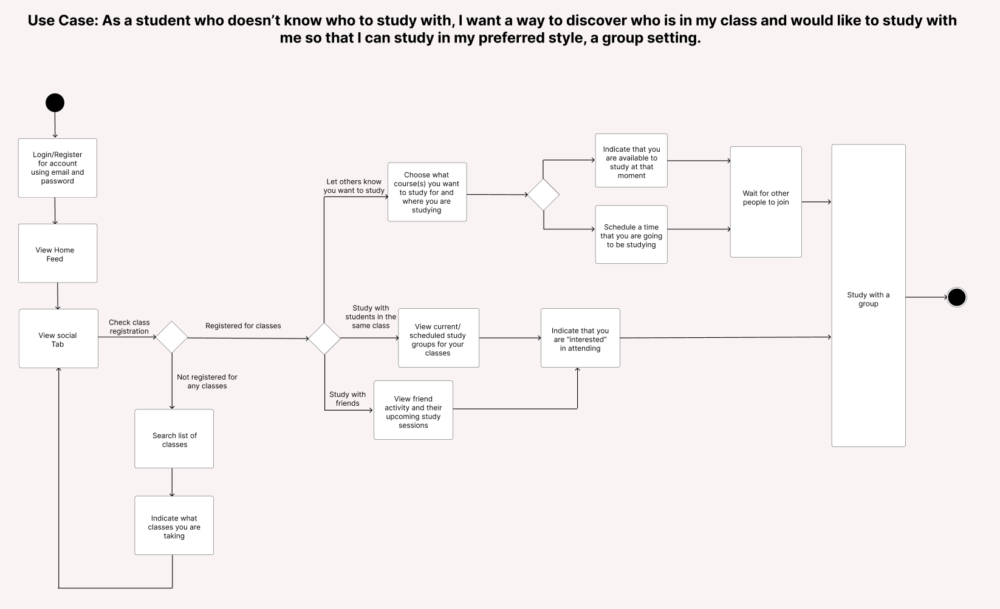

# Specification Phase Exercise

A little exercise to get started with the specification phase of the software development lifecycle. See the [instructions](instructions.md) for more detail.

## Team members

[Danilo Montes](https://github.com/danilo-montes) \
[Sanjaya Bhatta](https://github.com/itSanjaya) \
[Evan Huang](https://github.com/EV9H) \
[Bhavig Pointi](https://github.com/bpointi)

## Stakeholders

### Lin Shue (NYU Student)

Problems/Frustration:

- Needing to search for up to 20 minutes just to find a place to sit/study
- Having to move to a different location if all spots in a particular area are taken
- Has specific locations that are conducive to their productivity, and not finding any of them available is a major frustration as they would have to settle for an unideal location
- Not having/knowing about areas to study conversationally

Needs/Goals:
- Finding a spot to study
- Determining how packed an area for studying is
- Finding a new spot to habitually go to 
- Effectively using all available time to study/work (no wasting unnecessary time)

### Esther Wu (NYU IT Desk Member):
Problems/Frustrations:
- Some complaints about premature shutdown of NYU Scan & Reserve
- Not nearly enough usage as what was expected, and hardly know anyone that used it personally
- App maintenance could have been better; certain bugs like automatics sign-outs made the app difficult to use
- Lack of use among student body meant that students sometimes encountered someone already sitting at their reserved space; a reservation system may not be the ideal solution for students looking to find study spots with available seating

Needs/Goals:
- Reinstate ability view available seating in library and other locations, save for the Eat reservations (COVID-19 area capacity restrictions have been lifted)
- Offer a students a way to easily contact other students through the app for a joint study session—essentially a social component
- The option to filter locations by more than just space type and hours, such as noise level
- Make the app feel easy to navigate and communicate its purpose clearly so that more students would feel inclined to use it
- Plans were set to introduce a fun tab (displayed as “coming soon” in the app) to introduce students to different events around campus

## Product Vision Statement

StudySpotter is a one-stop-shop for the studious Violet seeking available spots to study on campus, discovering new study locations based on their specific needs, and finding others to study with.

## User Requirements

### Social
1. As a [student who doesn’t know who to study with], I want [a way to discover who is in my class and would like to study] so that [I can study in my preferred style: a group setting].
2. As a [student who wants to discover new places to study], I want [to find newer places] so that [I can meet new people to study together].
3. As a [student], I want [an easy way to see where my friends are currently studying], so that [I can join them]
4. As a [student who likes to plan ahead], I want [to be able to schedule a study session for myself/ my team] so that [we can always stick to our schedule]
5. As a [student], I want [to be able to let others know where I start studying], so that [they can study with me]
### Search
6. As a [student], I want [to gauge how filled study areas are] so that [I can determine if it is a good place for me to study].
7. As a [student who wants to discover a quiet place to study], I want [to find quieter places] so that [I can focus on my materials]
8. As a [student who finds a change of study environment refreshing], I want [daily suggested study locations based on novelty and availability], so that [I can benefit from studying in different places]
9. As a [student that prefers not to walk], I want [a map overview of all suitable study spots near me], so that [I don’t have to walk far to study]
### Functional
10. As a [student that would like to help contribute to other’s people’s knowledge of good study spots], I want [a way to report the characteristics of a particular spot] so that [other people can find suitable places to study at]
11. As a [student that likes to keep track of their study stats], I want [to be able to see stats like hours studied at my favorite spot], so that [I feel motivated by a record of my progress]

## Activity Diagrams

## [Link to Interactive Prototype](https://www.figma.com/proto/iP4zj6bMcgTh4W49lfLxPL/StudySpotter---SE-Project-1?node-id=48%3A2540&scaling=scale-down&page-id=36%3A477&starting-point-node-id=48%3A2540)
